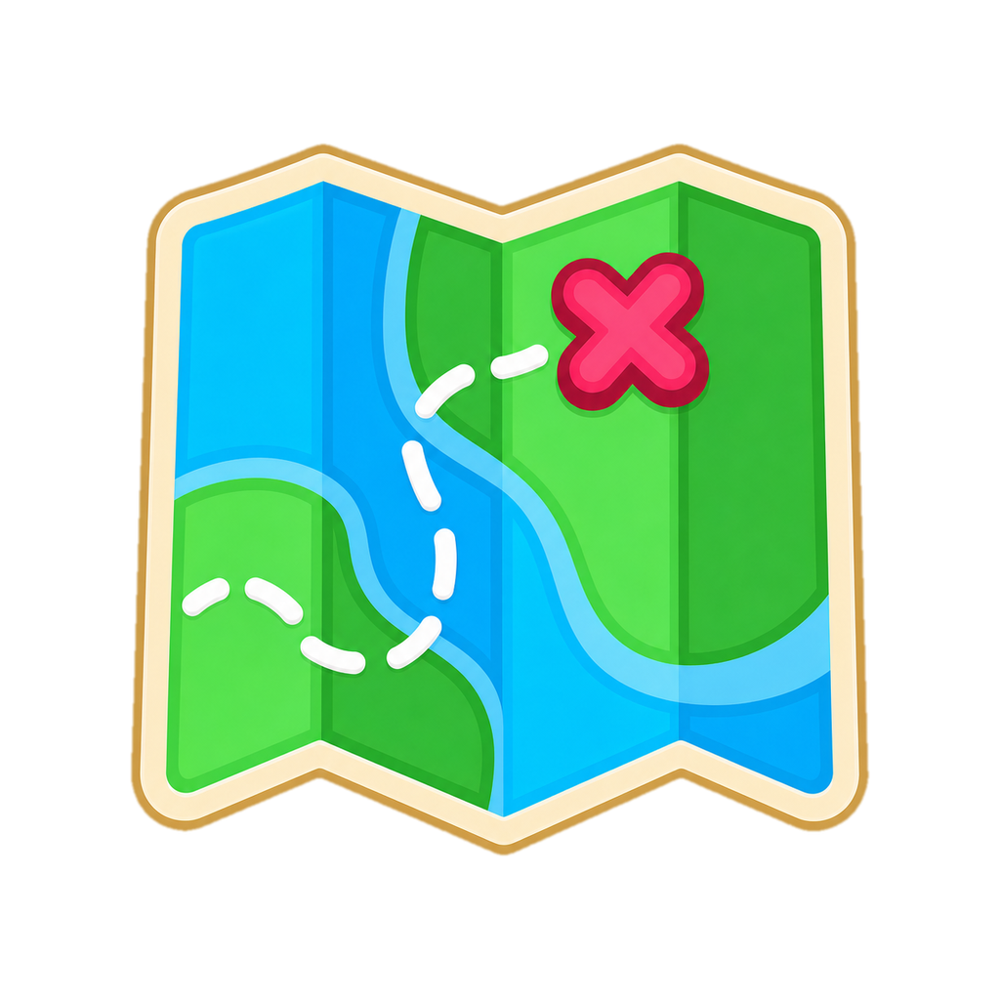

<p align="center">
  <a href="https://mascotl.cn/">
    
  </a>
</p>

<h1 align="center">LiveMap</h1>

<p align="center">
  基于画面匹配与计算机视觉算法的实时地图同步工具。
  <br>
  支持自定义地图导入、实时位置同步和社区点位标记共享。
</p>

<p align="center">
  <a href="https://github.com/MascotL/livemap/blob/main/LICENSE"></a>
  <a href="https://github.com/MascotL/livemap/releases"></a>
  <a href="https://github.com/MascotL/livemap/releases"></a>
</p>

## 功能特性

- 实时捕获游戏窗口画面，并根据小地图内容匹配当前位置。
- 独立实时地图窗口，支持缩放、拖拽和置顶显示。
- 支持导入自定义地图包与点位标记文件。

## 运行环境

- Windows 10 / Windows 11

## 基本使用

1. 启动 `livemap.exe`。
2. 在主界面选择要捕获的游戏窗口。
3. 按提示框选小地图区域。
4. 导入地图包或点位文件。
5. 打开实时地图窗口查看同步结果。

## 构建要求

- Go 1.26.2+
- Wails v2
- Visual Studio Build Tools 2022
- CMake 3.21+
- OpenCV，供 `native/mapmatch_dll` 构建使用

## 构建 native DLL

### wgc_capture.dll

```powershell
cd native\wgc_dll
cmake -S . -B build -A x64
cmake --build build --config Release
```

生成文件通常位于：

```text
native\wgc_dll\build\Release\wgc_capture.dll
```

### mapmatch.dll

如果 OpenCV 安装目录不是 `C:\opencv\build\install`，需要在配置时指定 `OpenCV_DIR`。

```powershell
cd native\mapmatch_dll
cmake -S . -B build -A x64 -DOpenCV_DIR="C:\opencv\build\install"
cmake --build build --config Release
```

生成文件通常位于：

```text
native\mapmatch_dll\build\Release\mapmatch.dll
```

## 构建应用

先确认两个 native DLL 已放到运行目录，然后在项目根目录执行：

```powershell
wails build
```

也可以直接用 Go 编译嵌入了前端静态资源的程序：

```powershell
go build -o livemap.exe .
```

## 项目结构

```text
.
├── assets/                 # 图标、字体和嵌入资源
├── cmd/livemap/frontend/   # Wails 前端静态资源
├── internal/               # Go 应用逻辑
├── native/mapmatch_dll/    # OpenCV 地图匹配 DLL
├── native/wgc_dll/         # Windows Graphics Capture DLL
├── main.go                 # Wails 桌面应用入口
└── wails.json              # Wails 配置
```

## 许可

本项目使用 AGPL-3.0 许可证。
